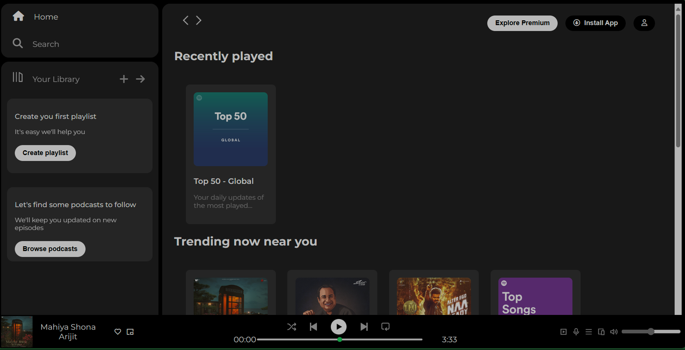

# Spotify Web Player Clone

This project is a clone of the Spotify web player, aiming to replicate its main features and layout. It provides users with a simulated Spotify experience, allowing them to explore music, create playlists, and access various sections of the platform.
This is frontend and the backend will be done in near future.

## Features
- **Navigation:** The sidebar navigation allows users to navigate between different sections of the platform, including Home and Search.
- **Library:** Users can access their library, create playlists, and browse podcasts.
- **Recently Played:** Displays recently played playlists or tracks.
- **Trending Now:** Highlights trending playlists or tracks based on the user's location.
- **Featured Charts:** Showcases featured playlists or tracks.
- **Music Player:** Includes a functional music player with playback controls, progress bar, and volume control.

## Preview

## Technologies Used
- **HTML:** Used for structuring the web pages.
- **CSS:** Utilized for styling the web player.
- **External Libraries:** Utilized Remix Icon and Font Awesome for icons.

## Setup and Usage
1. Clone the repository to your local machine.
2. Open the `index.html` file in your preferred web browser.
3. Explore the different sections of the web player and enjoy the simulated Spotify experience!

## Credits
- **Icons:** Icons used in the project are sourced from Remix Icon and Font Awesome.
- **Images:** Images used in the project are from Spotify and other free image repositories.

## License
This project is licensed under the MIT License.
